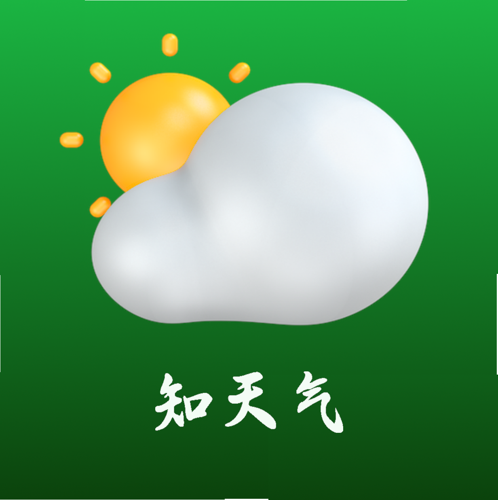
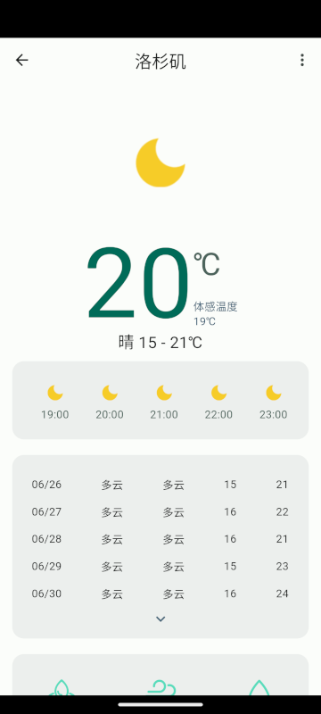

# 知天气（know weather）

一个由flutter构建，关注天气的APP

## APP screenshot：

<table>
    <tr>
        <td >
          
        </td>
        <td >
          
        </td>
        <td >
          
        </td>
    </tr>
    <tr>
       <td >
          
        </td>
        <td >
          
        </td>
        <td >
          
        </td>
    </tr>
    <tr>
       <td >
          
        </td>
        <td >
          
        </td>
    </tr>
</table>

## Highlights of features：

- view World weather
- locate local weather (limited to China)
- 24-hour weather forecast
- weather forecast for 15 days
- air quality
- living index
- search for weather related to other cities
- login and registration
- ...

## Use flutter technology
- [Bloc](https://bloclibrary.dev) - a predictable state management library that helps implement the BLoC design pattern.
- [Realm](https://realm.io/) - a fast, scalable alternative to SQLite with mobile to cloud data sync that makes building real-time, reactive mobile apps easy.
- [Amap](https://lbs.amap.com/) - amap flutter location plugin.
- [go_router](https://github.com/flutter/packages/tree/main/packages/go_router) - a declarative routing package for Flutter that uses the Router API to provide a convenient, url-based API for navigating between different screens. You can define URL patterns, navigate using a URL, handle deep links, and a number of other navigation-related scenarios.
- [flutter_svg](https://github.com/dnfield/flutter_svg/tree/master/packages/flutter_svg) - Draw SVG files using Flutter.
- ...

## Development environment
Ubuntu 23.04 (Lunar Lobster) Desktop

Andorid

## Development tool
Visual Studio Code

